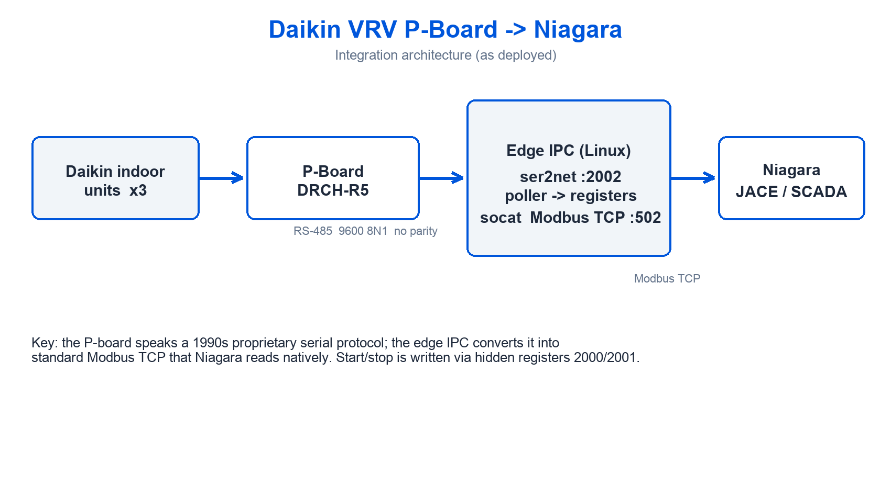
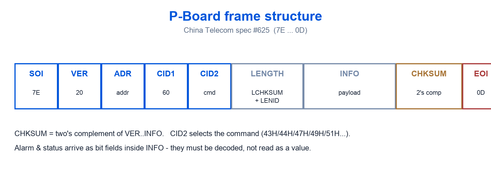
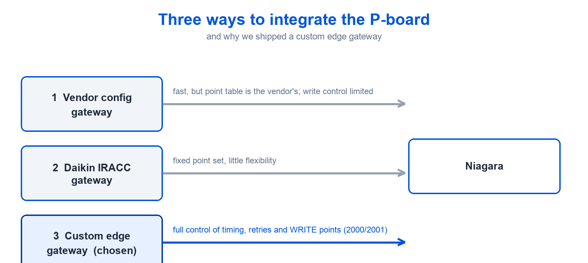

# Integrating a Daikin VRV P-Board (DRCH-R5) into Niagara — Field Notes

Protocol notes, point mapping and integration lessons for the Daikin **DRCH-R5** remote-monitoring interface board
(known in China as the **邮电 P板**, protocol based on the China Telecom / P&T spec **#625**) — bringing it into
**Niagara (Tridium N4)** via Modbus TCP.

> Legacy VRV boards are the long tail of building automation. Hundreds of thousands are still running, and there is
> almost nothing useful written about them in English. These are our field notes from a live integration.



---

## The problem nobody writes about

If you have ever inherited an older Daikin VRV site, you know the board: the **P-board** — Daikin's remote-monitoring
interface board, model **DRCH-R5** (also known in China as the "邮电 P板", because its protocol is based on the China
Telecom spec #625).

It speaks a proprietary 1990s-era serial protocol over RS-485. It is not Modbus. It is not BACnet. And there is
almost nothing useful about it in English — the handful of forum threads that exist are people asking
*"has anyone programmed the DRCH-R4/R5 protocol?"* and getting no answer.

We integrated it into Niagara on a live deployment and made it work. Here is the honest technical version.

## What the P-board actually is

| Item | Detail |
|---|---|
| Interface | RS-485 (also RS-232 on some builds) |
| Serial params | **9600, 8, N, 1** — and yes, **no parity** |
| Capacity | **1 board = up to 3 indoor units**, addressed as LINE0 / LINE1 / LINE2 = station 1 / 2 / 3 |
| Wiring to the Daikin side | the board is wired **in parallel with the indoor unit's wired-remote (controller) line** — it behaves as a second remote controller, up to 3 indoor units per board |
| Protocol root | China Telecom / P&T spec #625 (邮电规格) |

**The first trap:** the official manual states *odd parity*. It is wrong. The engineering ruling (and every live
capture) says **parity = none**. If you follow the manual you get 100% offline and no error that points at parity.

## The frame, byte by byte



```
SOI(7E) VER(20) ADR CID1(60) CID2 LENGTH(LCHKSUM+LENID) INFO CHKSUM EOI(0D)
```

- `CHKSUM` = two's complement of the bytes from `VER` through `INFO`
- `CID2` is the command: `43H/44H/47H/49H/51H`… (read status, read data, set, etc.)
- `INFO` carries the payload; alarm data arrives as **bit fields** you must extract yourself.

There are two protocol variants in the wild: the **P&T spec** frames (`7E … 0D`) and a vendor "Format2"
(`02 … 03` + BCC XOR). A board answers one, not both. Details and worked examples: **[`PROTOCOL.md`](PROTOCOL.md)**.

## Choosing the integration route



There are three routes, in increasing order of control:

1. **Vendor protocol gateway** (a configuration box with a `DAIKIN_DRCH-R5` plugin) → forwards to **Modbus TCP :502**.
   Fast to deploy; you trust the vendor's point table.
2. **Daikin's own gateway** (IRACC) → fixed point set, limited flexibility.
3. **A custom edge gateway** — our choice. A small Linux IPC running a serial poller and a Modbus TCP server.
   Full control over timing, retries, and which points are writable.

We shipped route 3 because the site needed **write** capability that the off-the-shelf boxes would not expose.

## Getting it into Niagara

The edge gateway exposes **Modbus TCP :502**. Niagara side is then trivial and robust:

- Niagara **Modbus TCP driver** → device → points
- Map the analog registers and digital bits per the vendor point table
- Watch the byte/word order on any scaled (float) point — default little-endian is not universal

Two mapping rules that cost us time:

- **Analog:** `Modbus address = BACnet register × 2 + 1`
- **Digital:** `Modbus address = BACnet register + 1`

Full walk-through: **[`NIAGARA-INTEGRATION.md`](NIAGARA-INTEGRATION.md)**.

## The write-control gotcha

Read is easy. **Write** is where this board humbles people.

Temperature and fan-speed **writes are effectively locked** on this interface. What *does* work is start/stop via the
board's **hidden control addresses** (2000 / 2001 → FC06 0/1), which the vendor documentation does not advertise
clearly. We found them, verified them on site, and that is the only writable control path we ship.

## Practical checklist

- Parity **none**; 9600 8N1; timeouts generous
- Station number = LINE index, not a device address you invent
- An empty LINE reports offline — that is normal, not a fault
- Alarm and status points are **bit fields** — decode, don't read as a value
- Return-air temperature arrives as an integer scaled by 100 (watch your raw/engineering scaling)
- Verify start/stop by reading the run state back — never trust the write response alone

## The takeaway

Legacy VRV boards are the long tail of building automation: hundreds of thousands of them, still running, and almost
no documentation in English. Whoever writes a clean, tested driver for them is not competing on price — they are
competing on *nobody else can do it*.

That is a much better place to stand.

---

## Repository contents

| Path | What |
|---|---|
| [`PROTOCOL.md`](PROTOCOL.md) | The P&T #625 frame in detail: fields, length/checksum math, CID2 command map, scaling, error codes |
| [`NIAGARA-INTEGRATION.md`](NIAGARA-INTEGRATION.md) | Three integration routes, Modbus↔BACnet point mapping rules, the write-control workaround |
| [`examples/drch_r5_poll.py`](examples/drch_r5_poll.py) | Minimal Python reference: build a frame, compute LENGTH/CHKSUM, parse a reply, poll a board |
| [`figs/`](figs/) | Architecture, frame structure and route-comparison diagrams |

## Disclaimer

These notes describe a **field integration of a documented-but-obscure protocol**. Verify everything against your own
board and the vendor's original specification before commissioning. The example code is a reference skeleton, not
production software.

---

*Shanghai GLINENET — Tridium certified partner since 2014, Niagara-only for 12 years. We build Niagara modules and
edge gateways for hard integration problems.*

**Tags:** `Daikin` `DRCH-R5` `DRCH-R4` `P-board` `邮电P板` `VRV` `Niagara` `Tridium` `N4` `Modbus` `RS-485` `building automation` `BMS` `protocol`
